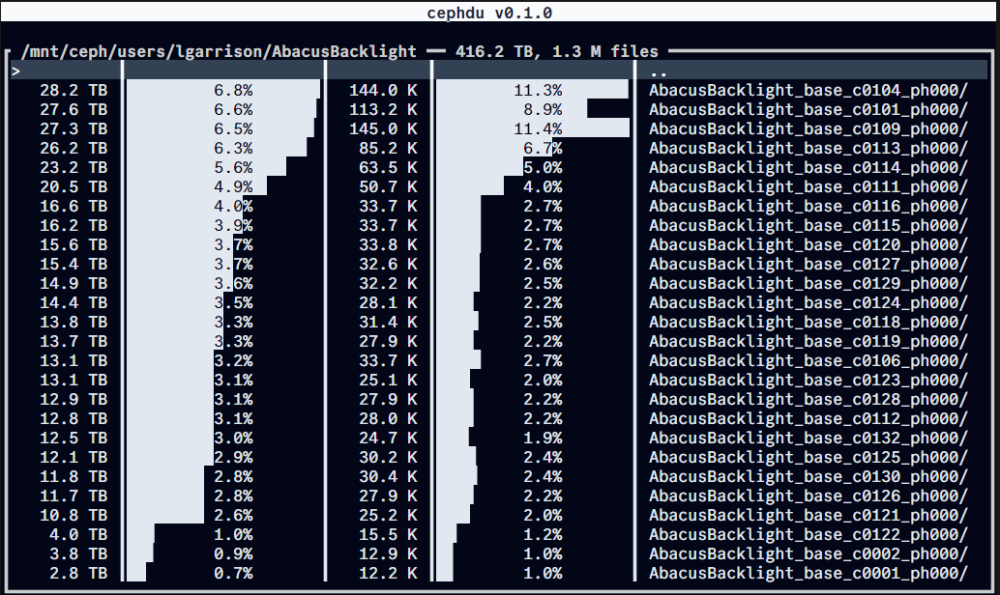

# cephdu

A `ncdu`-like TUI for the Ceph File System. Uses the `rbytes` and `rentries` xattrs to display directory sizes and file counts without walking the file system.

[](https://github.com/flatironinstitute/cephdu/actions/workflows/rust.yml) [](https://ratatui.rs/)

## Screenshot


## Background

`ncdu` and similar applications that display disk usage work by crawling the filesystem (walking the directory tree) and recursively adding up file sizes and counts. On most filesystems, there's no alternative. However, the Ceph File System stores the recursive bytes and recursive counts (`ceph.dir.rbytes` and `ceph.dir.rentries`) as "extended attributes", available with the `getxattr` syscall. This means we can get disk usage info without a potentially expensive crawl.

## Installation
cephdu consists of a single binary, compiled from Rust. The binary can be downloaded from a release or built from source.

### Binaries
Binaries are attached to each GitHub Release: https://github.com/flatironinstitute/cephdu/releases

### From Source
To build and run with a Rust toolchain [installed](https://www.rust-lang.org/tools/install), from inside the repo run:
```console
cargo run
```

To build an executable (dynamically linked by default):
```console
cargo build --release
```

To build an executable that contains a default path to use if one is not given:
```console
CEPHDU_DEFAULT_DIR=/mnt/ceph/users/\$USER cargo build --release
```
The literal string `$USER` is substituted at runtime.

To build a static executable:
```console
cargo build --release cargo build --target=x86_64-unknown-linux-musl
```

## Usage
Simply run `cephdu` from the command line and an interactive terminal user interface (TUI) will be displayed. Navigate using the arrow keys and Enter. For a full list of keyboard shortcuts, press `?`.

The CLI accepts one optional argument, the initial directory:
```console
❯ cephdu --help
Display ceph space and file count (inode) usage in an interactive terminal

Usage: cephdu [PATH]

Arguments:
  [PATH]  Path to the directory to display

Options:
  -h, --help  Print help
```

## License
MIT

## Author
[Lehman Garrison](https://github.com/lgarrison/)
