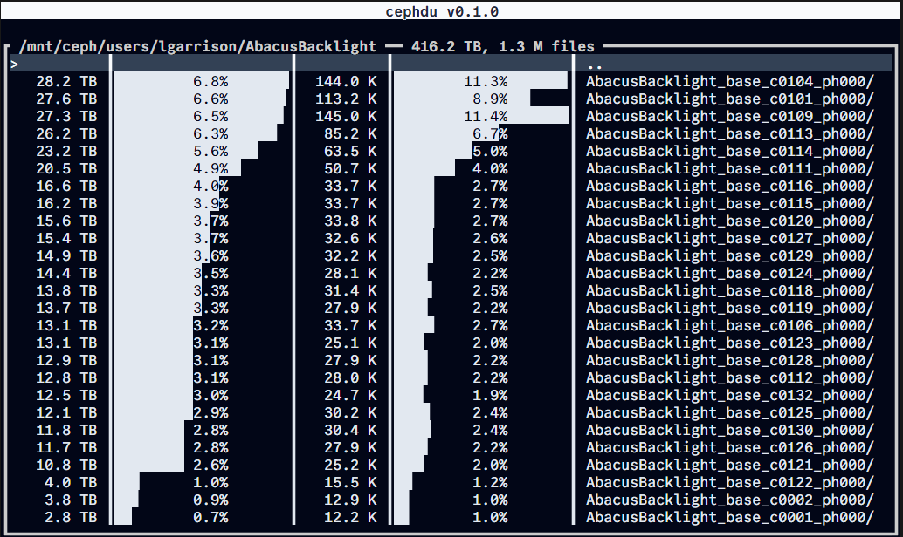

# cephdu

A `ncdu`-like TUI for the Ceph File System. Uses the `rbytes` and `rentries` xattrs to display directory sizes and file counts without walking the file system.

[](https://github.com/flatironinstitute/cephdu/actions/workflows/rust.yml) [](https://ratatui.rs/)

## Screenshot


## Background

`ncdu` and similar applications that display disk usage work by crawling the filesystem (walking the directory tree) and recursively adding up file sizes and counts. On most filesystems, there's no alternative. However, the Ceph File System stores the recursive bytes and recursive counts (`ceph.dir.rbytes` and `ceph.dir.rentries`) as "extended attributes", available with the `getxattr` syscall. This means we can get disk usage info without a potentially expensive crawl.

## Installation
cephdu consists of a single binary, compiled from Rust. The binary can be downloaded from a release or built from source.

### Binaries
Binaries are attached to each GitHub Release: https://github.com/flatironinstitute/cephdu/releases

### From Source
To build and run with a Rust toolchain [installed](https://www.rust-lang.org/tools/install), from inside the repo run:
```console
cargo run
```

To build an executable (dynamically linked by default):
```console
cargo build --release
```

To build an executable that contains a default path to use if one is not given:
```console
CEPHDU_DEFAULT_DIR=/mnt/ceph/users/\$USER cargo build --release
```
The literal string `$USER` is substituted at runtime.

To build a static executable:
```console
cargo build --release cargo build --target=x86_64-unknown-linux-musl
```

## Usage
Simply run `cephdu` from the command line and an interactive terminal user interface (TUI) will be displayed. Navigate using the arrow keys and Enter. For a full list of keyboard shortcuts, press `?`.

The CLI accepts one optional argument, the initial directory:
```console
❯ cephdu -h
Display ceph space and file count (inode) usage in an interactive terminal

Usage: cephdu [OPTIONS] [PATH]

Arguments:
  [PATH]  Path to the directory to display

Options:
  -f, --flat        Print a flat text listing, with units, instead of the interactive interface
  -p, --parseable   Print a flat text listing of raw values for parsing
      --tui         Use the interactive interface even if stdout is not a terminal
  -n, --name        Sort by name
  -s, --size        Sort by size
  -c, --count       Sort by file count
  -u, --owner       Sort by owner
  -t, --time        Sort by change time
  -r, --reverse     Reverse the sort order
  -d, --dirs-first  List directories before files
  -e, --exact       Show sizes and counts in full instead of scaled to a unit
  -l, --long        Show the owner and directory times, which cost extra syscalls. Implies -f
  -h, --help        Print help
```

### Sorting
Listings are sorted largest first unless one of `-n`, `-s`, `-c`, `-u` or `-t` is
given, which choose the field to sort on. They apply to both the interactive
interface and flat listings, and each field starts in the direction its sort key
uses in the interface: sizes, counts and change times read most-first, names and
owners read ascending. In the interface, pressing the field's key reverses it from
there.

`-r` reverses whichever order is in effect and combines with the field flags, so
`cephdu -r` reads smallest first and `cephdu -nr` reverses the name order.

`-d` groups directories ahead of files, whatever the field and direction, sorting
within each group by the usual rules. In the interactive interface, `d` toggles it.

`-e` prints sizes and counts in full instead of scaled to a unit, which is useful
when the rounding matters; `e` toggles it in the interface. The parseable format is
always exact, so `-e` has no effect there.

The bottom border of the interface names the sort in effect, as in `size ↓` for
largest first or `name ↑` for A to Z, and appends `· dirs first` while directories
are being grouped.

### Colors
The interface names as few colors as it can, inheriting the terminal's own, so it
suits a light terminal as well as a dark one without being told which it is. The
colors it does name are the row the cursor is on, and red and yellow for errors and
warnings. The bars keep the terminal's own color on every row, cursor included, so
the column reads as one chart. Flat listings are never colored.

`NO_COLOR` is honored. Since it suppresses colors but not attributes, a colored
band would simply disappear, so the cursor row falls back to bold when it is set.

### Symlinks
Symlinks are marked the way `ls -F` marks them, with a trailing `@` beside the `/`
that directories already carry. The size shown is the symlink's own — the length of
the path it holds — rather than its target's, and a symlink to a directory is listed
among the files. Following one is not implemented yet.

### What costs extra, and `-l`
Two things are not read unless something asks for them, because each one costs extra
syscalls — and on Ceph each of those is a round trip to the metadata server:

* **The owner.** It is the only thing a directory needs a `stat` for — size and
  count are xattrs and the kind comes from `readdir`. Turning the uid into a name is
  cheap by comparison, and happens once per distinct owner rather than once per
  entry.
* **A directory's recursive time.** It is one of the three xattr reads a directory
  otherwise makes, and those reads dominate a large listing: on ten thousand
  directories, `43s` with `-l` against `30s` without.

So without `-l` a directory costs two xattr reads and no `stat` at all, and a uid is
never turned into a name.

A file's size and change time come from the one `stat` it needs regardless, so they
are always shown.

`-l` implies `-f`, since a flat listing is the one with no way to ask later, and so
it conflicts with `--tui`. Without it, `--flat` drops the owner column, while every
other column stays and shows `-` for what is missing; `--parseable` always keeps all
six fields.

The interface asks instead: `u` and `t` read what they need when pressed and keep it
afterwards, so toggling a column off and on costs nothing. Moving to another
directory or refreshing reads afresh, and reads only what the visible columns and the
current sort need — so ordering by owner or by change time fetches it whether or not
the column is on screen.

A directory's time is Ceph's `rctime`: the newest ctime anywhere beneath it, its own
included, so changing only its permissions moves it. It is a propagated value that
starts at zero — creating a directory does not give it one — so a directory nothing
has happened in since it was made shows the epoch, the usual way a Unix timestamp
says it was never set. `ls -l` shows a date there instead, because it shows the
directory's *own* mtime, which creation does set. Creating something inside a
directory does set the parent's, so only the leaves of a fresh tree read the epoch.

### Reading the border
The top border shows the current path on the left and the directory's totals on
the right. A path too long for the border loses its start, marked with `…`, so
that the deepest components stay visible as you navigate.

### Scrolling
The listing scrolls sideways with the left and right arrow keys when the rows are
wider than the terminal, which happens once the owner or time columns are shown.
The whole listing moves, gauges included; the border and its labels stay put.

### Slow directories
Reading a directory costs a round trip to the metadata server per entry, so a
huge one can take minutes. The interface doesn't block on it: the directory
already on screen stays usable while the read runs, a notice counts the entries
read so far — against the directory's total, which on Ceph is known upfront — and
`Esc` or `Ctrl-C` stops the read and stays put. Navigating
somewhere else simply abandons the read in favor of the new one, quitting never
waits, and the interface appears immediately at startup even when the first
directory is slow. A read that finishes promptly shows none of this.

## Flat text mode
`cephdu --flat` prints the listing as text instead of drawing the interactive
interface, with the same units the interface uses:
```console
❯ cephdu --flat /mnt/ceph/users/$USER | head -3
 1.1 TB   48.2 K  Dec 11 09:15  alice:scc  data/
 2.1 GB        1  Dec 10 23:53  alice:scc  bigfile.h5
 4.1 KB       12  Dec 10 23:36  alice:scc  scripts/
```

`--parseable` prints the same listing as raw values instead, one row of six
tab-separated fields per entry — size in bytes, recursive entry count,
change time in Unix seconds, user, group, and name — with `-` for anything
the filesystem doesn't provide (recursive values are only available on Ceph).
Directory names keep their trailing `/`, and `..` is not listed. Symlinks are *not*
marked here: a filename may contain `@`, so a parser could not tell a mark from a
character. Only the two human formats mark them.

```console
❯ cephdu --parseable /mnt/ceph/users/$USER | head -3
1099511627776	48213	1765432100	alice	scc	data/
2147483648	1	1765400000	alice	scc	bigfile.h5
4096	12	1765399000	alice	scc	scripts/
```

The parseable format does not change based on whether stdout is a terminal, so it
stays parsable regardless of how it is invoked:
```console
❯ cephdu -p | awk -F'\t' '$1 > 1e12 {print $6}'    # directories over 1 TB
```

Because the interactive interface draws to stdout, a flat listing is printed
automatically when stdout is not a terminal, so `cephdu | ...` and `cephdu > file`
do something useful. That implied listing is parseable, on the grounds that
whatever is reading a pipe is more often a program than a person. Pass `--tui` to
override the detection, which is occasionally needed under tools that run a
program on a pseudo-terminal.

## Tests
```console
cargo test
```
The tests in `tests/ceph.rs` cover the recursive xattrs, so they need a CephFS
mount and skip themselves when there isn't one. They put a scratch tree in
`/mnt/ceph/users/$USER` by default; set `CEPHDU_TEST_DIR` to use somewhere else.

`tests/syscalls.rs` counts how many syscalls a listing costs, using `strace`, and
skips without it. `cargo test -- --nocapture` prints the table.

## Availability on Flatiron Institute Clusters

`cephdu` is available under the `fi-utils` module on the Flatiron Institute clusters, rusty and popeye, and is the preferred way to look at disk usage on ceph.

## License
MIT

## Author
[Lehman Garrison](https://github.com/lgarrison/)
